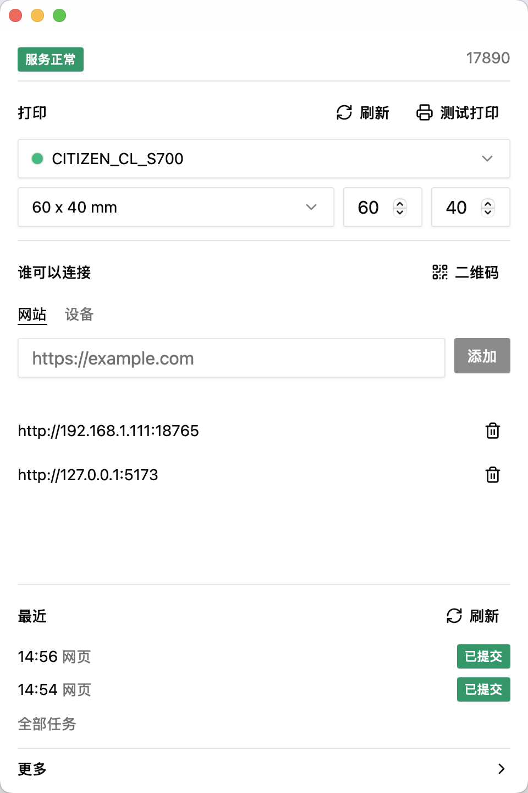

# 印枢

本机打印代理。网站、手机和局域网设备把任务交给工位上的印枢，操作系统打印队列出纸。

面向仓库、门店、国产工位和信创环境。不宣称任何信创认证。

[English](./README_en.md)

## 适配的操作系统

安装包只从 [Releases](https://github.com/wu9007/yinshu/releases) 下载。当前只发布 Windows x64 的 NSIS（`.exe`）。

| 系统 | 版本 | 架构 | 安装包 |
| --- | --- | --- | --- |
| Windows | 10、11 | x64 | NSIS（`.exe`） |
| macOS | 10.15 Catalina 及以上 | Apple Silicon、Intel | `.dmg`。目前未签名、未公证，需右键打开或去掉隔离属性。本版本未发布 |
| Linux 桌面 | webkit2gtk 4.1，例如 Ubuntu 22.04+、Debian 12+ | x64、ARM64 | deb、rpm、AppImage |
| Linux 无界面 | 同上 | x64、ARM64 | deb、rpm |
| 手机 / 平板 | iOS、Android 系统浏览器 | — | 无安装包。扫工位二维码，由已放行的网页打印。HTTPS 页面连不上 `ws://` |

<p align="center">
  
</p>

## 做什么

- 托盘常驻。打印机、纸张、网站名单、设备名单在同一屏。
- 网站按 Origin 放行，设备按 IP / 网段放行。不默认放行全网。
- 手机扫二维码拿到 `ws://地址:端口/ws`。本机浏览器不用扫，始终能连。
- PDF、图片、Office、HTML，以及 ESC/POS / TSPL / ZPL。

装好后从托盘打开设置：选打印机和纸张，加网站，需要时再放行设备。点「测试打印」确认能出纸。

## 开发

```bash
pnpm --dir apps/desktop tauri dev
```

无界面 Linux：

```bash
yinshu printer set-default "Printer Name"
yinshu paper set 60 40
yinshu origin add "https://example.com"
yinshu ip add "192.168.1.0/24"
```

## 网站怎么连

浏览器连 `ws://127.0.0.1:17890/ws`。局域网设备换成这台电脑的地址。握手 Origin 必须已在网站名单里。

```json
{
  "type": "print",
  "request_id": "req-1",
  "job_id": "job-1",
  "format": "pdf",
  "file_url": "https://example.com/label.pdf"
}
```

`queued` 表示进了本机队列。`submitted` 表示已交给系统打印队列，不表示纸已经出来。协议见 [技术说明](docs/technical.md)。

## 待办
- Windows 7、Windows 8.1
- 银河麒麟、优麒麟、OpenKylin 及其他国产桌面（含仍是 webkit2gtk 4.0 的版本）
- 龙芯 LoongArch

## License

[Apache License 2.0](./LICENSE)。Windows 随包的 SumatraPDF 见 [THIRD_PARTY_NOTICES.md](./THIRD_PARTY_NOTICES.md)。
