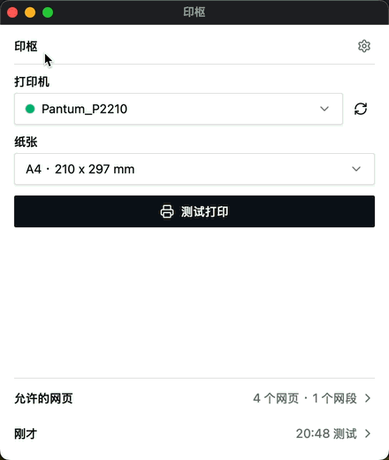

# 印枢

本机打印代理。可信页面或手机把任务发过来，系统打印队列出纸。不弹系统打印框。

[English](./README.md) · **中文**

[Demo](https://github.com/wu9007/yinshu-demo) · [安装包](https://github.com/wu9007/yinshu/releases) · [协议](docs/technical.md)

<p align="center">
  
</p>

## 使用

1. 从 [Releases](https://github.com/wu9007/yinshu/releases) 安装。托盘 → 打印机、纸张、**测试打印**。
2. 把当前页面的 Origin 加进网站名单。必须 **协议 + 主机 + 端口** 完全一致。

   `http://localhost:5173` · `http://127.0.0.1:5173` · `https://erp.example.com`
3. 连接 `ws://127.0.0.1:17890/ws`。手机扫设置里的二维码，用上面的 `ws://主机:17890/ws`。

HTTPS 页面打不开 `ws://`。开发时用 `http://localhost`。

### 打印

```json
{
  "type": "print",
  "request_id": "req-1",
  "job_id": "job-1",
  "format": "pdf",
  "file_url": "https://example.com/label.pdf"
}
```

不写 `printer_name` / `paper` 就用托盘默认值。

| format | 传什么 | 注意 |
| --- | --- | --- |
| `pdf` `image` `docx` `xlsx` `pptx` | `file_url` | Office 需要本机 Office / WPS / LibreOffice |
| `html` | `file_url` | 只能是公网 http(s)。需要 Chrome / Edge |
| `raw-html` | `html` | 同一套渲染。不要传 `file_url` |
| `raw` | `data_base64` | 字节原样下发（ZPL / TSPL / ESC/POS）。不要传 `file_url` / `paper` / `copies` |

列打印机：`{ "type": "get_printers_list", "request_id": "req-1" }`。

血签 ZPL：[yinshu-demo](https://github.com/wu9007/yinshu-demo)（`packages/print-zpl`）。

### 状态

`queued` = 这里收下了。`submitted` = 交给系统了。不是“纸已经出来”。失败是 `job_status` + `failed`。

### 卡住了

| 现象 | 先看 |
| --- | --- |
| 连不上 | 印枢开了吗？Origin 一字不差吗？HTTPS 页 + `ws://` 会失败 |
| 握手被关 | 网站名单漏了这个 Origin（端口也要写） |
| RAW 打出十六进制 / 当字 | 机子语言要是 ZPL（或 TSPL）。任务必须是 `format: "raw"` |
| Office / HTML 失败 | 转换软件或 Chrome/Edge 装了吗？文件地址是公网吗？ |

## 适配的操作系统

安装包只从 [Releases](https://github.com/wu9007/yinshu/releases) 下载。当前只发布 Windows x64 的 NSIS（`.exe`）。

| 系统 | 版本 | 架构 | 安装包 |
| --- | --- | --- | --- |
| Windows | 10、11 | x64 | NSIS（`.exe`） |
| macOS | 10.15 Catalina 及以上 | Apple Silicon、Intel | `.dmg`。目前未签名、未公证，需右键打开或去掉隔离属性。本版本未发布 |
| Linux 桌面 | webkit2gtk 4.1，例如 Ubuntu 22.04+、Debian 12+ | x64、ARM64 | deb、rpm、AppImage |
| Linux 无界面 | 同上 | x64、ARM64 | deb、rpm |
| 手机 / 平板 | iOS、Android 系统浏览器 | — | 无安装包。扫工位二维码，由已放行的网页打印。HTTPS 页面连不上 `ws://` |

## 待办

还没有安装包、CI 或真机验证，暂不支持：

- Windows 7、Windows 8.1
- 银河麒麟、优麒麟、OpenKylin 及其他国产桌面（含仍是 webkit2gtk 4.0 的版本）
- 龙芯 LoongArch

## 安全

只加你信任的网站和设备。不要写 `0.0.0.0/0`。端口不要暴露到不可信网络。

## 开发本仓

```bash
pnpm --dir apps/desktop tauri dev
```

## 许可

[Apache-2.0](./LICENSE) · SumatraPDF：[THIRD_PARTY_NOTICES.md](./THIRD_PARTY_NOTICES.md)
