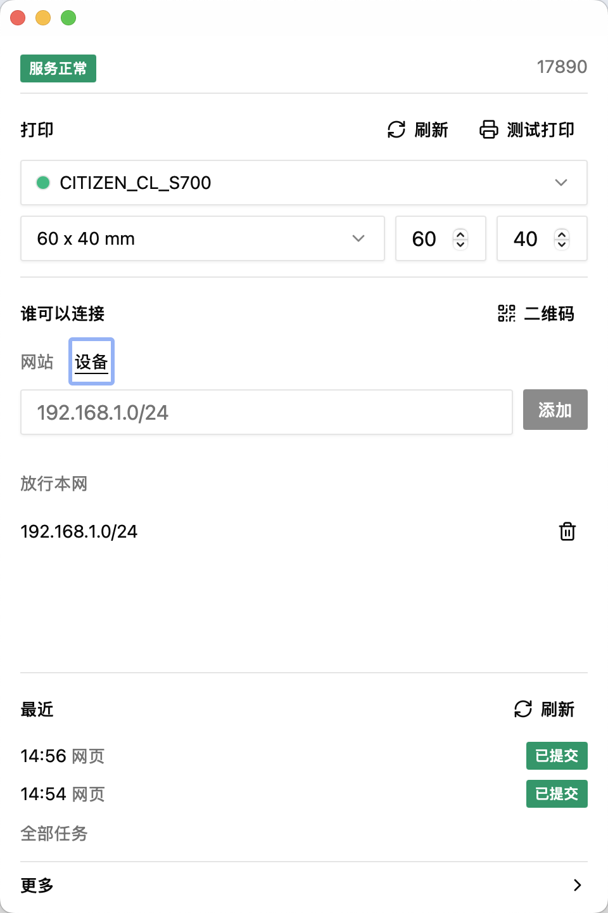

# YinShu (印枢)

A print agent on the workstation. Websites and LAN devices send jobs to YinShu; the OS print queue puts them on paper.

Built for warehouses, stores, and domestic / Xinchuang workstations. No certification is claimed.

[中文](./README.md)

<p align="center">
  
  
  
</p>

## Supported operating systems

Installers are only on [Releases](https://github.com/wu9007/yinshu/releases).

| OS | Versions | Arch | Packages |
| --- | --- | --- | --- |
| Windows | **7**, 8.1, 10, 11 | x64 | NSIS (`.exe`), MSI. Windows 7 needs WebView2; prefer NSIS |
| macOS | 10.15 Catalina and later | Apple Silicon, Intel | `.dmg` |
| Linux desktop | webkit2gtk 4.1, e.g. Ubuntu 22.04+, Debian 12+ | x64, ARM64 | deb, rpm, AppImage |
| Linux headless | same | x64, ARM64 | deb, rpm |

No 32-bit Windows. No Windows ARM builds.

## What it does

- Lives in the tray. Printer, paper, website list, and device list are one screen.
- Websites are allowed by Origin. Devices are allowed by IP or CIDR. The whole internet is never allowlisted by default.
- Phones get `ws://host:port/ws` from a QR code. The browser on this computer can always connect.
- PDF, images, Office, HTML, and raw commands such as ESC/POS, TSPL, and ZPL.

After install, open settings from the tray: pick a printer and paper, add websites, allow devices if needed, then use test print.

## Develop

```bash
pnpm --dir apps/desktop tauri dev
```

Headless Linux:

```bash
yinshu printer set-default "Printer Name"
yinshu paper set 60 40
yinshu origin add "https://example.com"
yinshu ip add "192.168.1.0/24"
```

## Connect from a website

A browser page connects to `ws://127.0.0.1:17890/ws`. LAN devices use this computer’s address. The handshake Origin must be on the website list.

```json
{
  "type": "print",
  "request_id": "req-1",
  "job_id": "job-1",
  "format": "pdf",
  "file_url": "https://example.com/label.pdf"
}
```

`queued` means the local queue accepted the job. `submitted` means it reached the system print queue, not that paper has come out. Protocol: [technical notes](docs/technical_en.md).

## License

[Apache License 2.0](./LICENSE). Windows ships SumatraPDF under its own terms; see [THIRD_PARTY_NOTICES.md](./THIRD_PARTY_NOTICES.md).
