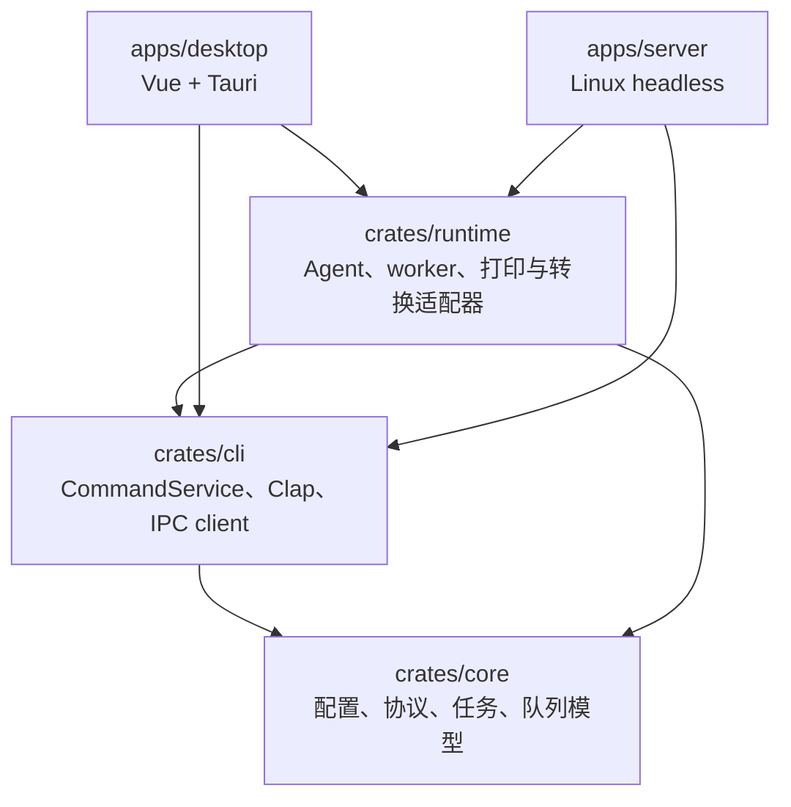
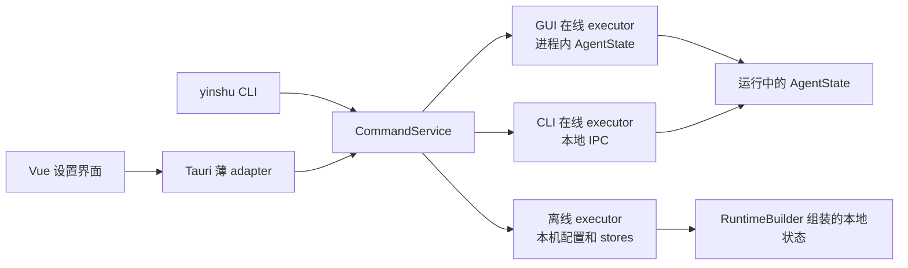

# 印枢技术说明

[English](./technical_en.md)

## 技术栈

| 层级        | 技术                                                                                 |
| ----------- | ------------------------------------------------------------------------------------ |
| 框架        | [Tauri 2](https://v2.tauri.app/)                                                     |
| 前端        | [Vue 3](https://vuejs.org/) + [TypeScript](https://www.typescriptlang.org/)          |
| UI          | [shadcn-vue](https://www.shadcn-vue.com/) + [Tailwind CSS](https://tailwindcss.com/) |
| 构建        | [Vite](https://vite.dev/)                                                            |
| 后端        | Rust + [Axum](https://docs.rs/axum/latest/axum/) + [Tokio](https://tokio.rs/)        |
| 存储        | JSON配置文件 + [SQLite](https://www.sqlite.org/)                                     |
| Office 转换 | Windows：Microsoft Office → WPS Office → LibreOffice；macOS/Linux：LibreOffice     |
| 平台打印    | [SumatraPDF](https://www.sumatrapdfreader.org/)(Windows) / CUPS `lp` (macOS/Linux)   |

## 当前架构

YinShu 采用 Cargo workspace，将纯业务模型、运行时能力、功能命令和最终产品分开。Vue 前端属于完整桌面产品，因此放在 `apps/desktop`，不放进 Rust crate。

```text
YinShu/
├── Cargo.toml
├── crates/
│   ├── core/       # 纯模型与规则
│   ├── cli/        # 统一功能命令、Clap parser、本地 IPC client
│   └── runtime/    # Agent 状态、worker、平台适配器、WebSocket、本地 IPC server
├── apps/
│   ├── desktop/
│   │   ├── src/            # Vue 3 前端
│   │   └── src-tauri/      # Tauri 产品入口与薄 IPC adapter
│   └── server/             # Linux headless 产品、systemd、deb/rpm packaging
├── scripts/
└── docs/
```

### 依赖方向



`crates/core` 不依赖 Tauri、Axum、Clap 或 SQLite。`apps/desktop` 和 `apps/server` 只负责产品入口、平台路径、生命周期组合和打包，不复制队列、配置或打印业务。

### crate 职责

| 模块 | 主要职责 | 不负责 |
| --- | --- | --- |
| `crates/core` | `AgentConfig`、WebSocket 协议、IP/Origin 校验、打印模型、队列模型、任务历史 DTO | 文件系统产品路径、SQLite、网络 listener、Tauri |
| `crates/cli` | 强类型 `Command` / `CommandResult`、`CommandService`、Clap parser、配置导入导出、本地 IPC client | 启动 Agent、执行打印 worker、Tauri UI |
| `crates/runtime` | `AgentState`、`RuntimeBuilder`、`AgentRuntime`、队列 worker、SQLite stores、打印/Office/HTML 适配器、WebSocket 与本地 IPC server | GUI、systemd 安装脚本、产品参数分发 |
| `apps/desktop` | Vue 设置界面、Tauri commands、托盘、自启动、桌面打包 | REST API、业务规则、headless `serve` |
| `apps/server` | `serve` 入口、Linux 固定路径、依赖预检、signal/systemd readiness、deb/rpm | GUI、桌面托盘、用户级服务安装 |

### 统一功能命令

设置、打印机和纸张查询、日志、任务历史、配置导入导出和测试打印都表示为 `crates/cli::Command`。GUI 和 Clap 不直接操作配置文件、SQLite 或打印后端，而是调用同一个 `CommandService`。



命令策略分为：

- `OnlineOnly`：必须由运行中的 Agent 执行，例如状态、内存日志和测试打印。
- `OnlinePreferred`：优先调用运行中的 Agent；只有明确返回 `NotRunning` 时才允许离线执行。
- `OfflineAllowed`：可以直接在离线 executor 中执行，例如配置文件校验。

权限错误、IPC 协议错误和 runtime 错误不会被当成“Agent 未运行”，因此不会静默回退并产生两份状态。

### 本地 IPC

外部 CLI 管理运行中 Agent 时不经过 HTTP。Unix 使用 runtime 目录下的 `agent.sock`，权限固定为 `0660`；Windows 使用稳定命名管道。请求和响应使用带 `protocol_version`、`request_id` 的 JSON envelope，外层帧为 4-byte big-endian 长度，单帧最大 8 MiB。GUI 的 Tauri adapter 与 Agent 位于同一进程，直接调用同一个 `CommandService`，不启动子进程，也不解析 CLI stdout。

桌面默认 runtime 目录位于应用配置目录的 `run/`；Linux headless 使用 `/run/yinshu/agent.sock`。IPC server 和 WebSocket、队列 worker 共用同一个取消信号，并由 `AgentHandle` 统一等待关闭和清理。

### Agent 生命周期

`RuntimeBuilder` 创建目录、读取 `config.json`、打开 `task_history.sqlite3`，并注入当前平台的打印后端与 HTML renderer。`AgentRuntime::start()` 完成 WebSocket listener 和本地 IPC listener 的绑定，再启动队列 worker，最后返回 `AgentHandle`。

关闭时，`AgentHandle::shutdown()` 停止接收新连接，取消后台 worker，等待已有任务退出，并删除 Unix socket。headless 在所有组件成功启动后才发送 systemd `READY=1`，停止前发送 `STOPPING=1`。

### 两个产品

两个产品的软件包不同，但都只交付名为 `yinshu` 的可执行文件：

| 产品 | package | 无参数行为 | `serve` |
| --- | --- | --- | --- |
| Desktop | `yinshu-desktop` | 启动 GUI | 明确拒绝 |
| Linux headless | `yinshu-server` | 显示 CLI 帮助 | `yinshu serve` 显式启动 Agent |

Linux desktop 与 headless 包双向声明冲突，不能同时安装，也不会自动替换另一产品。headless 安装时创建 `yinshu` 系统用户并自动启用 systemd system service。

### 网络边界

Axum router 只暴露 `GET /ws`。配置、打印机、纸张、日志、任务历史和测试打印均不提供 REST API。WebSocket 连接同时受客户端 IP 白名单和浏览器 Origin 白名单限制；打印任务、查询消息、ping/pong 和任务状态事件继续使用既有 WebSocket 协议。

## 产品边界

YinShu 是本机打印 Agent，不是打印机驱动，也不替代系统打印队列。

- 配置中的 `service.host` 保持为 `127.0.0.1` 兼容字段；当前服务实际绑定 `0.0.0.0:{port}`
- 浏览器侧主要通过 WebSocket `/ws` 下发任务
- 网络安全模型同时包含客户端 IP 白名单和 WebSocket Origin 白名单
- 打印队列串行执行
- `submitted` / `success` 表示已提交到系统打印队列，不表示打印机已经真实出纸
- Windows 使用随包资源中的 SumatraPDF
- macOS 和 Linux 使用系统 CUPS 命令行工具

## 支持范围

当前版本适合以下文件类型：

- PDF
- PNG/JPEG 图片，任务格式可传 `image`，本地服务会按文件内容识别
- docx/xlsx/pptx Office 文件。Windows 按格式依次尝试 Microsoft Office、WPS Office、LibreOffice；macOS/Linux 调用本机 LibreOffice。YinShu 会把文件转换为临时 PDF，再提交到系统打印队列；转换效果由实际选中的 Office 软件、字体和系统环境决定。
- 原始打印指令（Raw Commands），任务格式传 `raw`，内容使用 `data_base64`

### Office 转换

Office 文件会先按 OOXML 容器内容确认格式，再复制到任务专属的临时目录并补上正确扩展名。macOS/Linux 使用带隔离用户配置的 LibreOffice headless 进程转换，并把宏安全级别设为最高且不配置可信路径。Windows 先通过 Microsoft Word/Excel/PowerPoint COM 转换，再尝试 WPS Writer/Spreadsheets/Presentation COM，最后尝试 LibreOffice；只在可执行文件或 COM 不可用、不能确认新建进程归任务所有，或必要的自动化安全控制不可用时回退。文档打开、密码、转换、超时和无效 PDF 等任务失败不会回退。

Windows COM 转换会关闭宏自动化和外部链接交互，并只关闭通过 PID、启动时间和进程名确认由本任务新建的实例，不复用或关闭用户已有进程。WPS 若不能证明独立实例所有权，会被视为不可用；单组件模式持续复用已有进程时，可以尝试多组件安装模式。成功任务日志会记录实际使用的转换器。

发布 Windows WPS 能力前，应在真实 Windows 环境分别验证 DOCX、XLSX、PPTX：转换成功、无可见窗口、宏不执行，并且用户已打开的 WPS 会话不受影响。

单次转换最长 120 秒。转换后会校验输出文件存在、非空且以 `%PDF-` 开头，随后清理临时文件。Windows 超时时会按进程 PID、启动时间和进程名确认归属后，只终止本任务启动的 Office 实例；不会关闭用户已有的 Office 会话。

raw 模式可以承载调用方已经生成好的 ESC/POS、TSPL、TSPL2、ZPL、EPL、PCL、PostScript 等设备指令。YinShu 只负责把 bytes 原样提交到系统打印队列，不解析这些指令，也不生成标签、小票或 RFID 指令。

原始打印指令任务不支持 `file_url`、`paper`、`copies`。如果业务需要多份 raw 输出，应由业务系统生成多份 raw 指令或发送多个 job。

HTML 模式支持 `html` 和 `raw-html`：前者由本机 Agent 下载 URL 页面并渲染，后者由本机 Agent 渲染调用方直接提供的 HTML 文本。两者都会先转换为临时 PDF，再进入普通 PDF 打印链路。

## 开发

安装依赖：

```bash
pnpm install --frozen-lockfile
```

启动桌面开发模式：

```bash
pnpm --dir apps/desktop tauri dev
```

Tauri 会同时启动 Vite 开发服务：

```text
http://localhost:1420/
```

本地服务默认监听：

```text
0.0.0.0:17890
```

同机 Web 页面通常连接 `127.0.0.1`。局域网内其他设备如果需要连接这台电脑上的 YinShu 服务，可以使用这台电脑的局域网 IP，例如 `192.168.1.23`。

## 使用前配置

首次运行后，需要在 YinShu 设置界面完成：

1. 选择默认打印机
2. 选择或填写默认纸张
3. 把业务系统的 Origin 加入白名单，例如 `https://example.com`

Origin 必须精确匹配浏览器 WebSocket 握手中携带的 `Origin`，包括协议、域名和端口。示例：

```text
http://localhost:5173
https://example.com
```

白名单只校验发起连接的网页来源，不校验被打印文件 URL 的域名。

## CLI 运维入口

YinShu 提供 `yinshu` CLI，用于在不打开 GUI 的情况下查看和修改功能状态。desktop 和 headless 共用 `crates/cli` 中的 Clap parser。允许离线的命令可以在 Agent 未运行时执行；`status`、内存日志和测试打印等 `OnlineOnly` 命令要求 Agent 已运行。

```bash
yinshu printer
yinshu printer "Printer Name"
yinshu printer set-default "Printer Name"

yinshu paper
yinshu paper set 60 40

yinshu service
yinshu service set-port 17521

yinshu origin
yinshu origin add "https://example.com"
yinshu origin delete "https://example.com"
yinshu ip
yinshu ip add "192.168.1.0/24"
yinshu ip delete "192.168.1.0/24"

yinshu task
yinshu task "JOB-001"
yinshu task clear
yinshu status
yinshu logs
yinshu test-print
yinshu doctor
yinshu doctor --json

yinshu config export ./yinshu-config.json --only service-port --only allowed-ips
yinshu config import ./yinshu-config.json --preview
yinshu config validate

# 仅 Desktop 产品支持
yinshu autostart enable
yinshu app language zh-CN

# 仅 Linux headless 产品提供
yinshu serve
```

CLI 与 GUI 共用强类型 `CommandService`；GUI 在进程内执行命令，外部 CLI 通过本地 IPC 调用运行中的 Agent。`serve` 只存在于 Linux headless 产品。

`doctor` 只检查本地配置、目录权限、Agent/IPC、端口、打印机、浏览器、Office 转换器以及 Headless systemd 环境；不会启动 Office、提交打印或修改配置。Office 检查拆分为 `office.docx`、`office.xlsx`、`office.pptx`，显示候选顺序和首个被动探测到的转换器；真正的 COM 激活、进程所有权和转换能力在任务运行时验证。有 FAIL 时退出码为 1，只有 WARN 时仍为 0。其他稳定退出码为：参数错误 2、Agent 未运行 3、权限错误 4、冲突 5。

## Headless Linux 部署

`yinshu serve` 只存在于 `yinshu-server`。deb/rpm 安装时创建 `yinshu` 系统用户并启用 `yinshu.service`；桌面包不接受 `serve`。GUI 与 headless 软件包双向冲突，升级保留数据，purge 才删除 `/etc/yinshu` 和 `/var/lib/yinshu`。

服务使用 `Type=notify`，配置、状态和 runtime 目录分别为 `/etc/yinshu`、`/var/lib/yinshu`、`/run/yinshu`。使用 `systemctl status yinshu`、`journalctl -u yinshu` 或 `yinshu status` 排障。

## 配置导出与导入

设置界面支持把部分配置导出为加密 JSON 文件，也可以从加密 JSON 文件导入配置。导出文件默认名为：

```text
yinshu-config.json
```

导出时可以勾选以下配置项，默认全部选中：

- 本地端口
- Origin 白名单列表
- IP 白名单列表

CLI 默认导出全部字段，也可以重复使用 `--only` 选择 `service-port`、`allowed-origins` 和 `allowed-ips`。密码交互时隐藏输入；自动化使用 `--password-file`，不提供会把密码暴露到进程列表的 `--password`。导入总是先生成差异预览，并只覆盖文件实际包含的字段；非交互导入需要 `--password-file --yes`。

导出时需要填写密码，密码可以留空；留空时仍然会按同一套加密流程生成文件。

导入时需要选择配置文件并输入导出时使用的密码。导入会先展示预览，确认后只覆盖文件中包含的配置项；文件中没有包含的配置会保留现有值。

加密文件是普通 JSON 外壳，内部配置 payload 使用 Argon2id v1.3 和 AES-256-GCM 加密：

```json
{
  "format": "yinshu-config-encrypted",
  "version": 1,
  "crypto": {
    "kdf": "argon2id13",
    "memory_kib": 19456,
    "iterations": 2,
    "parallelism": 1,
    "cipher": "aes-256-gcm",
    "tag_bytes": 16,
    "salt": "<base64>",
    "nonce": "<base64>"
  },
  "payload": "<base64(ciphertext || tag)>"
}
```

解密后的 payload 格式为：

```json
{
  "format": "yinshu-config",
  "version": 1,
  "config": {
    "service": {
      "port": 17890
    }
  }
}
```

ERP 或其他系统如果需要生成可导入配置，可以参考 `examples/config-transfer/` 下的 PHP、Go 和 Node 实现。桌面端项目目录提供统一验证命令：

```bash
pnpm --dir apps/desktop verify:config-transfer-examples
```

## 本地管理与 WebSocket

网络 router 只暴露 `GET /ws`。桌面设置、配置导入导出、日志、任务历史和测试打印统一通过 `CommandService` 执行；GUI 使用进程内 Tauri adapter，外部 CLI 使用本地 IPC，不提供 REST API。运行状态使用 `yinshu status`、systemd notify 或 WebSocket ping/pong 检查。

配置示例：

```json
{
  "service": {
    "host": "127.0.0.1",
    "port": 17890
  },
  "security": {
    "allowed_origins": []
  },
  "printing": {
    "default_printer": null,
    "default_paper": null,
    "default_copies": 1
  },
  "limits": {
    "max_file_size_mb": 20,
    "max_batch_jobs": 20,
    "max_copies": 100,
    "download_timeout_seconds": 30
  },
  "app": {
    "autostart": false
  }
}
```

`service.host` 是兼容字段，保存时保持为 `127.0.0.1`；当前本地服务实际固定监听所有网卡。

## WebSocket API

连接地址：

```text
ws://127.0.0.1:17890/ws
```

浏览器连接时，本地服务会在握手阶段校验 `Origin`。如果不在白名单中，连接会被拒绝。

### 心跳

请求：

```json
{
  "type": "ping",
  "time": 1780000000000
}
```

响应：

```json
{
  "type": "pong",
  "time": 1780000000000
}
```

### 单个打印任务

```json
{
  "type": "print",
  "request_id": "REQ-001",
  "job_id": "JOB-001",
  "format": "pdf",
  "printer_name": "Office Printer",
  "file_url": "https://example.com/label.pdf",
  "copies": 1,
  "paper": {
    "width_mm": 60,
    "height_mm": 40
  }
}
```

`printer_name` 可以省略。省略时使用设置里的默认打印机。`paper` 可以省略。省略时使用设置里的默认纸张。

Office 任务：

```json
{
  "type": "print",
  "request_id": "REQ-OFFICE-001",
  "job_id": "JOB-OFFICE-001",
  "format": "docx",
  "file_url": "https://example.com/report.docx",
  "copies": 1,
  "paper": {
    "width_mm": 210,
    "height_mm": 297
  }
}
```

Office 文件支持 `docx`、`xlsx` 和 `pptx`，本地服务会调用当前平台的本机 Office 软件转换为临时 PDF，再进入 PDF 打印链路。Windows 按格式使用 Microsoft Office → WPS Office → LibreOffice；macOS/Linux 使用 LibreOffice。Office 任务只支持 HTTP(S) `file_url`，不支持 data URL。所有转换器均不可用、转换失败或超过 120 秒时，任务进入 `failed`。

HTML URL 任务：

```json
{
  "type": "print",
  "request_id": "REQ-HTML-001",
  "job_id": "JOB-HTML-001",
  "format": "html",
  "file_url": "https://example.com/invoice/1",
  "wait_ms": 1000,
  "copies": 1,
  "paper": {
    "width_mm": 210,
    "height_mm": 297
  }
}
```

内联 HTML 任务：

```json
{
  "type": "print",
  "request_id": "REQ-RAW-HTML-001",
  "job_id": "JOB-RAW-HTML-001",
  "format": "raw-html",
  "html": "<main><h1>Invoice</h1></main>",
  "wait_ms": 1000,
  "copies": 1,
  "paper": {
    "width_mm": 210,
    "height_mm": 297
  }
}
```

`html` 必须提供 HTTP(S) `file_url`，不接受内联 `html` 或 `data_base64`；`raw-html` 必须提供非空 `html`，不接受 `file_url` 或 `data_base64`。两种 HTML 任务的 `wait_ms` 可为 0 到 30000 毫秒，且支持 `copies` 和 `paper`。

浏览器端 JSSDK 使用 `fileUrl`、`waitMs` 并只序列化协议字段；HTML 到 PDF 的下载、渲染和打印都由本机 Agent 完成。HTML 页面及其 CSS、图片、脚本等加载资源仅允许公开 HTTP/HTTPS 地址；`file:`、本机地址和私网地址均会被拒绝。

### HTML 渲染前置条件与超时边界

HTML 渲染不随 YinShu 打包浏览器。所有平台和运行模式都必须使用已安装的 Chromium 系浏览器；不提供原生 WebView fallback：

| 平台 | 浏览器渲染器 |
| --- | --- |
| Windows | Edge → Chrome → Chromium |
| macOS | Chrome → Chromium |
| Linux | Chrome → Chromium |

GUI 和 `yinshu serve`（包括 systemd 托管的 headless 包）都遵循此要求；没有可用浏览器时，HTML 任务会返回 renderer-unavailable（`RendererUnavailable`）失败。

代理会安全拦截没有 `Referer` 或 `Origin` 的被拒资源；但这类请求无法可靠关联到当前 HTML 页面，任务历史未必记录 `BlockedResource`，生成的 PDF 也可能缺少该资源。

渲染使用总 deadline 的协作式取消：超时后不会开始后续浏览器阶段；已经开始的同步浏览器调用会在自身有界等待结束后返回并清理资源，不承诺跨进程的立即强制终止。

raw 任务：

```json
{
  "type": "print",
  "request_id": "REQ-RAW-001",
  "job_id": "JOB-RAW-001",
  "format": "raw",
  "printer_name": "TSC TE244",
  "data_base64": "XlhB..."
}
```

raw 任务不支持 `file_url`、`paper`、`copies`。TSPL/TSPL2 这类标签指令中的纸张、间隙、份数、文字、条码、RFID 等参数需要由业务系统写入 raw 指令内容。

### 批量打印任务

```json
{
  "type": "print_batch",
  "request_id": "REQ-002",
  "batch_id": "BATCH-001",
  "jobs": [
    {
      "job_id": "A-001",
      "format": "image",
      "file_url": "https://example.com/a.png",
      "copies": 1
    },
    {
      "job_id": "B-001",
      "format": "raw",
      "printer_name": "TSC TE244",
      "data_base64": "XlhB..."
    }
  ]
}
```

批量任务只表示一次接收多个 job，执行时仍然使用同一个串行队列。批量任务可以混合 PDF、image、Office 和 raw。

### 任务状态

任务被接收后，本地服务会返回或推送 `job_status`：

```json
{
  "type": "job_status",
  "request_id": "REQ-001",
  "job_id": "JOB-001",
  "status": "queued",
  "message": "queued"
}
```

状态值包括：

```text
queued
downloading
printing
submitted
completed
failed
unknown
cancelled
```

## 开发验证

前端检查：

```bash
pnpm --dir apps/desktop typecheck
pnpm --dir apps/desktop lint
pnpm --dir apps/desktop build
```

Rust 检查：

```bash
cargo fmt --all -- --check
cargo check --workspace
cargo clippy --workspace --all-targets -- -D warnings
cargo test --workspace
```

部分 Rust 测试会绑定本地 TCP 端口。如果沙箱或安全软件拦截本地网络，先在普通终端重跑后再判断是否是代码问题。

## 平台说明

Windows 打印依赖随包资源中的 SumatraPDF：

```text
apps/desktop/src-tauri/resources/windows/SumatraPDF.exe
```

当前资源来自 SumatraPDF 3.6.1 64-bit portable：

```text
ZIP SHA-256: 98b33a518d42986856d225064b0cd2d3643ecf78cbf84ab873d26cc51877a544
EXE SHA-256: 719f689b34f47be8ca105ce8484948474dafde0e106bab599e4a89326070c3d0
```

macOS 和 Linux 打印依赖系统 CUPS 命令行工具：`lpstat`、`lpoptions` 和 `lp`。YinShu 不会自动安装 CUPS 或打印机驱动；如果系统缺少这些命令，CLI 和 Agent 会返回明确错误，提示先安装或启用 CUPS。
